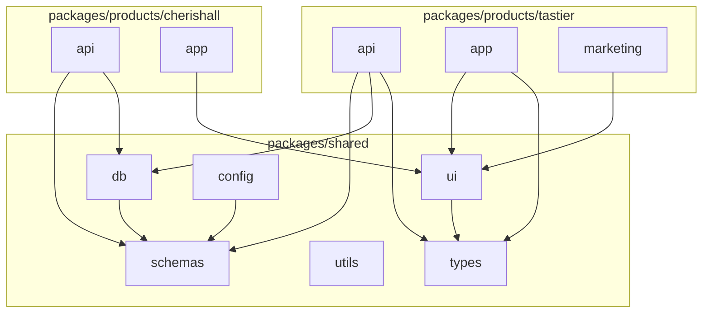
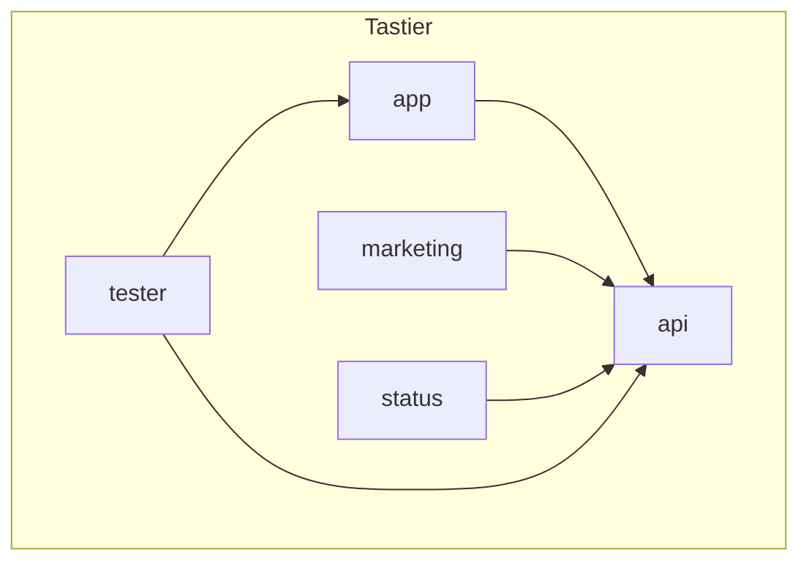
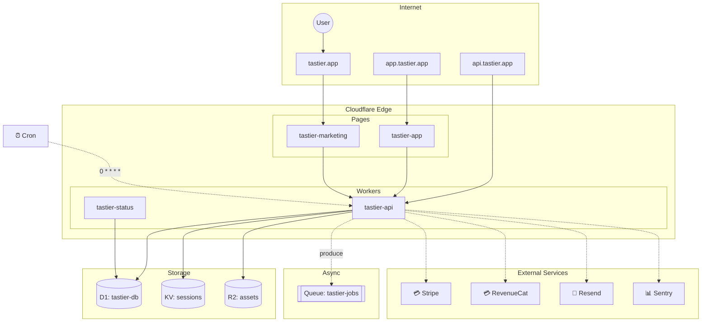

# Architecture Diagram Generation Plan

Auto-generate architecture diagrams from code using Dependency Cruiser → Mermaid.

## Overview

```
┌─────────────────┐     ┌─────────────────┐     ┌─────────────────┐
│   Source Code   │────▶│ Dependency      │────▶│    Mermaid      │
│   (imports)     │     │ Cruiser         │     │    Diagrams     │
└─────────────────┘     └─────────────────┘     └─────────────────┘
                                                        │
                               ┌────────────────────────┼────────────────────────┐
                               ▼                        ▼                        ▼
                        ┌─────────────┐          ┌─────────────┐          ┌─────────────┐
                        │    SVG      │          │  Markdown   │          │    Docs     │
                        │   Export    │          │   Embed     │          │   Site      │
                        └─────────────┘          └─────────────┘          └─────────────┘
```

## What Gets Diagrammed

| Level | Scope | Purpose |
|-------|-------|---------|
| **Monorepo** | All packages | High-level workspace dependencies |
| **Product** | Single product's services | How api/app/marketing connect |
| **Package** | Single package internals | Module structure within a package |
| **Circular** | Dependency cycles | CI validation, prevent tangles |

## Directory Structure

```
packages/
└── shared/
    └── arch-diagram/
        ├── src/
        │   ├── generate.ts           # Main generator script
        │   ├── config/
        │   │   ├── monorepo.ts       # Monorepo-level config
        │   │   ├── product.ts        # Product-level config
        │   │   └── package.ts        # Package-level config
        │   ├── themes/
        │   │   └── mermaid-theme.ts  # Consistent styling
        │   └── index.ts
        ├── .dependency-cruiser.cjs   # Base config
        ├── package.json
        └── tsconfig.json

docs/
└── en/
    └── architecture/
        ├── index.md                  # Overview + monorepo diagram
        ├── products/
        │   ├── tastier.md            # Tastier architecture
        │   └── cherishall.md         # Cherishall architecture
        └── diagrams/                 # Generated outputs
            ├── monorepo.mmd
            ├── monorepo.svg
            ├── tastier.mmd
            ├── tastier.svg
            └── ...
```

## Implementation

### Phase 1: Base Configuration

#### 1.1 Install Dependencies

```json
// packages/shared/arch-diagram/package.json
{
  "name": "@resist/arch-diagram",
  "type": "module",
  "exports": {
    ".": "./src/index.ts"
  },
  "scripts": {
    "generate": "tsx src/generate.ts",
    "generate:watch": "tsx watch src/generate.ts"
  },
  "dependencies": {
    "dependency-cruiser": "^16.0.0"
  },
  "devDependencies": {
    "tsx": "^4.7.0"
  }
}
```

#### 1.2 Base Dependency Cruiser Config

```javascript
// packages/shared/arch-diagram/.dependency-cruiser.cjs

/** @type {import('dependency-cruiser').IConfiguration} */
module.exports = {
  forbidden: [
    // Circular dependencies
    {
      name: 'no-circular',
      severity: 'error',
      from: {},
      to: {
        circular: true,
      },
    },
    // No orphan modules
    {
      name: 'no-orphans',
      severity: 'warn',
      from: {
        orphan: true,
        pathNot: [
          '\\.test\\.ts$',
          '\\.bench\\.ts$',
          '\\.spec\\.ts$',
          '\\.d\\.ts$',
        ],
      },
      to: {},
    },
    // Products should not import from other products
    {
      name: 'no-cross-product-imports',
      severity: 'error',
      from: {
        path: '^packages/products/([^/]+)/',
      },
      to: {
        path: '^packages/products/(?!\\1)[^/]+/',
      },
    },
    // Shared packages should not import from products
    {
      name: 'no-shared-to-product',
      severity: 'error',
      from: {
        path: '^packages/shared/',
      },
      to: {
        path: '^packages/products/',
      },
    },
  ],

  options: {
    doNotFollow: {
      path: ['node_modules', '\\.test\\.', '\\.bench\\.', '\\.spec\\.'],
    },
    tsPreCompilationDeps: true,
    tsConfig: {
      fileName: './tsconfig.json',
    },
    enhancedResolveOptions: {
      exportsFields: ['exports'],
      conditionNames: ['import', 'require', 'node', 'default'],
    },
    reporterOptions: {
      mermaid: {
        direction: 'TB',
        theme: 'neutral',
      },
    },
  },
};
```

### Phase 2: Generator Script

#### 2.1 Main Generator

```typescript
// packages/shared/arch-diagram/src/generate.ts

import { execSync } from 'node:child_process';
import { existsSync, mkdirSync, writeFileSync, readdirSync } from 'node:fs';
import { join, dirname } from 'node:path';
import { fileURLToPath } from 'node:url';

const __dirname = dirname(fileURLToPath(import.meta.url));
const ROOT = join(__dirname, '../../../../');
const OUTPUT_DIR = join(ROOT, 'docs/en/architecture/diagrams');

interface DiagramConfig {
  name: string;
  includeOnly: string;
  excludePattern?: string;
  focusDepth?: number;
  collapsePattern?: string;
}

// Diagram configurations
const DIAGRAMS: DiagramConfig[] = [
  // Monorepo overview - collapse to package level
  {
    name: 'monorepo',
    includeOnly: '^packages/',
    excludePattern: '\\.test\\.|__tests__|__mocks__',
    collapsePattern: '^packages/([^/]+/[^/]+)',
  },
  // Shared packages detail
  {
    name: 'shared',
    includeOnly: '^packages/shared/',
    collapsePattern: '^packages/shared/([^/]+)',
  },
];

function getProducts(): string[] {
  const productsDir = join(ROOT, 'packages/products');
  if (!existsSync(productsDir)) return [];

  return readdirSync(productsDir, { withFileTypes: true })
    .filter((d) => d.isDirectory() && !d.name.startsWith('['))
    .map((d) => d.name);
}

function generateDiagram(config: DiagramConfig): void {
  const { name, includeOnly, excludePattern, collapsePattern } = config;

  console.log(`Generating ${name} diagram...`);

  const args = [
    'depcruise',
    `--include-only "${includeOnly}"`,
    excludePattern ? `--do-not-follow "${excludePattern}"` : '',
    collapsePattern ? `--collapse "${collapsePattern}"` : '',
    '--output-type mermaid',
    '--config .dependency-cruiser.cjs',
    'packages/',
  ]
    .filter(Boolean)
    .join(' ');

  try {
    const mermaid = execSync(args, {
      cwd: ROOT,
      encoding: 'utf-8',
      maxBuffer: 10 * 1024 * 1024, // 10MB
    });

    // Write Mermaid file
    const mmdPath = join(OUTPUT_DIR, `${name}.mmd`);
    writeFileSync(mmdPath, mermaid);
    console.log(`  ✓ ${mmdPath}`);

    // Generate SVG using mmdc (mermaid-cli)
    const svgPath = join(OUTPUT_DIR, `${name}.svg`);
    try {
      execSync(`npx mmdc -i ${mmdPath} -o ${svgPath} -t neutral -b transparent`, {
        cwd: ROOT,
        encoding: 'utf-8',
      });
      console.log(`  ✓ ${svgPath}`);
    } catch {
      console.log(`  ⚠ SVG generation failed (install @mermaid-js/mermaid-cli)`);
    }
  } catch (error) {
    console.error(`  ✗ Failed to generate ${name}:`, error);
  }
}

function generateProductDiagrams(): void {
  const products = getProducts();

  for (const product of products) {
    // Product overview
    DIAGRAMS.push({
      name: `product-${product}`,
      includeOnly: `^packages/products/${product}/`,
      collapsePattern: `^packages/products/${product}/([^/]+)`,
    });

    // Product services detail
    const servicesDir = join(ROOT, 'packages/products', product);
    const services = readdirSync(servicesDir, { withFileTypes: true })
      .filter((d) => d.isDirectory())
      .map((d) => d.name);

    for (const service of services) {
      DIAGRAMS.push({
        name: `product-${product}-${service}`,
        includeOnly: `^packages/products/${product}/${service}/`,
      });
    }
  }
}

// Main
function main() {
  // Ensure output directory exists
  if (!existsSync(OUTPUT_DIR)) {
    mkdirSync(OUTPUT_DIR, { recursive: true });
  }

  // Add product diagrams
  generateProductDiagrams();

  // Generate all diagrams
  for (const config of DIAGRAMS) {
    generateDiagram(config);
  }

  console.log('\n✓ All diagrams generated');
}

main();
```

#### 2.2 Mermaid Theme

```typescript
// packages/shared/arch-diagram/src/themes/mermaid-theme.ts

export const MERMAID_CONFIG = {
  theme: 'base',
  themeVariables: {
    // Nodes
    primaryColor: '#e0f2fe',        // Light blue for packages
    primaryTextColor: '#0c4a6e',
    primaryBorderColor: '#0284c7',

    // Secondary (shared packages)
    secondaryColor: '#fef3c7',      // Light yellow
    secondaryTextColor: '#78350f',
    secondaryBorderColor: '#f59e0b',

    // Tertiary (external)
    tertiaryColor: '#f3f4f6',
    tertiaryTextColor: '#374151',
    tertiaryBorderColor: '#9ca3af',

    // Lines
    lineColor: '#64748b',

    // Fonts
    fontFamily: 'Inter, system-ui, sans-serif',
    fontSize: '14px',
  },
};

export function wrapWithTheme(mermaidCode: string): string {
  return `%%{init: ${JSON.stringify(MERMAID_CONFIG)}}%%\n${mermaidCode}`;
}
```

### Phase 3: CI Integration

#### 3.1 Validation Rule (Circular Dependencies)

```typescript
// packages/shared/arch-diagram/src/validate.ts

import { execSync } from 'node:child_process';
import { dirname, join } from 'node:path';
import { fileURLToPath } from 'node:url';

const __dirname = dirname(fileURLToPath(import.meta.url));
const ROOT = join(__dirname, '../../../../');

export function validateArchitecture(): { valid: boolean; errors: string[] } {
  const errors: string[] = [];

  try {
    execSync(
      'depcruise --validate --config .dependency-cruiser.cjs packages/',
      {
        cwd: ROOT,
        encoding: 'utf-8',
        stdio: 'pipe',
      }
    );
  } catch (error: any) {
    // Parse violations from output
    const output = error.stdout || error.stderr || '';
    const violations = output.match(/error [^:]+: .+/g) || [];
    errors.push(...violations);
  }

  return {
    valid: errors.length === 0,
    errors,
  };
}

// CLI entry
if (import.meta.url === `file://${process.argv[1]}`) {
  const result = validateArchitecture();

  if (result.valid) {
    console.log('✓ Architecture validation passed');
    process.exit(0);
  } else {
    console.error('✗ Architecture validation failed:\n');
    result.errors.forEach((e) => console.error(`  ${e}`));
    process.exit(1);
  }
}
```

#### 3.2 GitHub Actions

```yaml
# .github/workflows/architecture.yml

name: Architecture

on:
  push:
    branches: [main]
    paths:
      - 'packages/**/*.ts'
      - 'packages/**/package.json'
  pull_request:
    branches: [main]
    paths:
      - 'packages/**/*.ts'
      - 'packages/**/package.json'

jobs:
  validate:
    name: Validate Architecture
    runs-on: ubuntu-latest
    steps:
      - uses: actions/checkout@v4
      - uses: pnpm/action-setup@v2
      - uses: actions/setup-node@v4
        with:
          node-version: 20
          cache: pnpm

      - run: pnpm install

      # Validate no circular deps, no cross-product imports, etc.
      - name: Validate architecture rules
        run: pnpm --filter @resist/arch-diagram validate

  generate:
    name: Generate Diagrams
    runs-on: ubuntu-latest
    if: github.ref == 'refs/heads/main'
    needs: validate
    steps:
      - uses: actions/checkout@v4
      - uses: pnpm/action-setup@v2
      - uses: actions/setup-node@v4
        with:
          node-version: 20
          cache: pnpm

      - run: pnpm install

      # Generate diagrams
      - name: Generate architecture diagrams
        run: pnpm --filter @resist/arch-diagram generate

      # Commit if changed
      - name: Commit diagrams
        uses: stefanzweifel/git-auto-commit-action@v5
        with:
          commit_message: 'docs: update architecture diagrams [skip ci]'
          file_pattern: 'docs/en/architecture/diagrams/*'
```

### Phase 4: Documentation Integration

#### 4.1 Architecture Overview Page

```markdown
<!-- docs/en/architecture/index.md -->

# Architecture

Auto-generated architecture diagrams from source code.

## Monorepo Overview

High-level view of all packages and their dependencies.


<details>
<summary>View Mermaid source</summary>

\`\`\`mermaid
{{#include ./diagrams/monorepo.mmd}}
\`\`\`

</details>

## Shared Packages

Packages in `packages/shared/` used across products.


## Products

- [Tastier](./products/tastier.md)
- [Cherishall](./products/cherishall.md)

## Architecture Rules

These rules are enforced in CI:

| Rule | Description |
|------|-------------|
| No circular dependencies | Prevents import cycles |
| No cross-product imports | Products are isolated |
| No shared→product imports | Shared packages can't depend on products |
| No orphan modules | All modules must be imported somewhere |
```

#### 4.2 Product Architecture Page

```markdown
<!-- docs/en/architecture/products/tastier.md -->

# Tastier Architecture

## Service Overview


## Services

### API

Internal module structure of `packages/products/tastier/api`.


### App

Internal module structure of `packages/products/tastier/app`.


### Marketing

Internal module structure of `packages/products/tastier/marketing`.


```

### Phase 5: Package Scripts

#### 5.1 Package.json Scripts

```json
// packages/shared/arch-diagram/package.json
{
  "name": "@resist/arch-diagram",
  "scripts": {
    "generate": "tsx src/generate.ts",
    "validate": "tsx src/validate.ts",
    "watch": "chokidar 'packages/**/*.ts' -c 'pnpm generate'"
  }
}
```

#### 5.2 Root Package.json

```json
// package.json (root)
{
  "scripts": {
    "arch:generate": "pnpm --filter @resist/arch-diagram generate",
    "arch:validate": "pnpm --filter @resist/arch-diagram validate"
  }
}
```

#### 5.3 Turbo Config

```json
// turbo.json (additions)
{
  "tasks": {
    "arch:generate": {
      "inputs": ["packages/**/*.ts", "packages/**/package.json"],
      "outputs": ["docs/en/architecture/diagrams/**"],
      "cache": true
    },
    "arch:validate": {
      "inputs": ["packages/**/*.ts"],
      "outputs": [],
      "cache": true
    }
  }
}
```

## Output Examples

### Monorepo Level



### Product Level



## Summary

| Feature | Implementation |
|---------|---------------|
| Auto-generation | Dependency Cruiser → Mermaid → SVG |
| Levels | Monorepo, product, package |
| CI validation | Circular deps, cross-product imports |
| CI generation | Auto-commit on main |
| Output formats | .mmd, .svg |
| Docs integration | Embedded in architecture docs |

---

## Part 2: Infrastructure Diagrams

Auto-generate infrastructure diagrams from `wrangler.toml` files and DNS configuration.

### Overview

```
┌─────────────────┐     ┌─────────────────┐     ┌─────────────────┐
│  wrangler.toml  │────▶│                 │────▶│    Mermaid      │
│  files          │     │   Infra Parser  │     │    Diagrams     │
├─────────────────┤     │                 │     └─────────────────┘
│  DNS config     │────▶│                 │
│  (Terraform/CF) │     └─────────────────┘
└─────────────────┘
```

### What Gets Diagrammed

| Resource | Source | Auto-detected |
|----------|--------|---------------|
| Workers | `wrangler.toml` name | ✓ |
| Pages | Directory convention / config | ✓ |
| D1 | `[[d1_databases]]` | ✓ |
| KV | `[[kv_namespaces]]` | ✓ |
| R2 | `[[r2_buckets]]` | ✓ |
| Queues | `[[queues.producers]]` / `[[queues.consumers]]` | ✓ |
| Durable Objects | `[[durable_objects.bindings]]` | ✓ |
| Service Bindings | `[[services]]` | ✓ |
| Cron Triggers | `[triggers]` | ✓ |
| Routes/Domains | `routes` / `route` | ✓ |
| DNS Records | Terraform / Cloudflare API | ✓ |
| External Services | `services.json` manifest | Manual |

### Directory Structure (additions)

```
packages/
└── shared/
    └── arch-diagram/
        ├── src/
        │   ├── generate.ts              # Code dependency diagrams
        │   ├── infra/
        │   │   ├── generate.ts          # Infrastructure diagrams
        │   │   ├── parsers/
        │   │   │   ├── wrangler.ts      # Parse wrangler.toml
        │   │   │   ├── terraform.ts     # Parse Terraform DNS
        │   │   │   └── cloudflare.ts    # Query Cloudflare API
        │   │   ├── types.ts             # Infrastructure types
        │   │   └── renderer.ts          # Mermaid output
        │   └── index.ts
        └── package.json

packages/products/<product>/
├── iac/
│   ├── dns.tf                           # Terraform DNS config (if using)
│   └── services.json                    # External services manifest
├── api/wrangler.toml
├── app/wrangler.toml
├── status/wrangler.toml
└── marketing/wrangler.toml

docs/en/architecture/
└── diagrams/
    ├── infra-tastier.mmd
    ├── infra-tastier.svg
    └── infra-overview.svg
```

### Implementation

#### Phase 6: Infrastructure Types

```typescript
// packages/shared/arch-diagram/src/infra/types.ts

export interface Worker {
  name: string;
  path: string;
  routes?: string[];
  customDomains?: string[];
}

export interface D1Database {
  binding: string;
  databaseName: string;
  databaseId?: string;
}

export interface KVNamespace {
  binding: string;
  id?: string;
  preview_id?: string;
}

export interface R2Bucket {
  binding: string;
  bucketName: string;
}

export interface Queue {
  binding: string;
  queueName: string;
  type: 'producer' | 'consumer';
}

export interface DurableObject {
  binding: string;
  className: string;
  scriptName?: string;
}

export interface ServiceBinding {
  binding: string;
  service: string;
  environment?: string;
}

export interface CronTrigger {
  cron: string;
  description?: string;
}

export interface DNSRecord {
  type: 'A' | 'AAAA' | 'CNAME' | 'TXT' | 'MX';
  name: string;
  content: string;
  proxied?: boolean;
}

export interface ExternalService {
  name: string;
  type: 'api' | 'database' | 'auth' | 'payment' | 'analytics' | 'other';
  url?: string;
  description?: string;
}

export interface ProductInfrastructure {
  name: string;
  workers: Worker[];
  d1Databases: D1Database[];
  kvNamespaces: KVNamespace[];
  r2Buckets: R2Bucket[];
  queues: Queue[];
  durableObjects: DurableObject[];
  serviceBindings: ServiceBinding[];
  cronTriggers: CronTrigger[];
  dnsRecords: DNSRecord[];
  externalServices: ExternalService[];
}
```

#### Phase 7: Wrangler Parser

```typescript
// packages/shared/arch-diagram/src/infra/parsers/wrangler.ts

import { readFileSync, existsSync } from 'node:fs';
import { parse as parseToml } from '@iarna/toml';
import { join, dirname, basename } from 'node:path';
import type {
  Worker,
  D1Database,
  KVNamespace,
  R2Bucket,
  Queue,
  DurableObject,
  ServiceBinding,
  CronTrigger,
} from '../types';

interface WranglerConfig {
  name: string;
  main?: string;
  route?: string;
  routes?: Array<string | { pattern: string; custom_domain?: boolean }>;
  d1_databases?: Array<{
    binding: string;
    database_name: string;
    database_id?: string;
  }>;
  kv_namespaces?: Array<{
    binding: string;
    id?: string;
    preview_id?: string;
  }>;
  r2_buckets?: Array<{
    binding: string;
    bucket_name: string;
  }>;
  queues?: {
    producers?: Array<{ binding: string; queue: string }>;
    consumers?: Array<{ queue: string; max_batch_size?: number }>;
  };
  durable_objects?: {
    bindings?: Array<{
      name: string;
      class_name: string;
      script_name?: string;
    }>;
  };
  services?: Array<{
    binding: string;
    service: string;
    environment?: string;
  }>;
  triggers?: {
    crons?: string[];
  };
}

export function parseWranglerConfig(path: string): {
  worker: Worker;
  d1Databases: D1Database[];
  kvNamespaces: KVNamespace[];
  r2Buckets: R2Bucket[];
  queues: Queue[];
  durableObjects: DurableObject[];
  serviceBindings: ServiceBinding[];
  cronTriggers: CronTrigger[];
} {
  const content = readFileSync(path, 'utf-8');
  const config = parseToml(content) as unknown as WranglerConfig;

  // Parse routes
  const routes: string[] = [];
  const customDomains: string[] = [];

  if (config.route) {
    routes.push(config.route);
  }

  if (config.routes) {
    for (const route of config.routes) {
      if (typeof route === 'string') {
        routes.push(route);
      } else {
        if (route.custom_domain) {
          customDomains.push(route.pattern);
        } else {
          routes.push(route.pattern);
        }
      }
    }
  }

  const worker: Worker = {
    name: config.name,
    path: dirname(path),
    routes: routes.length > 0 ? routes : undefined,
    customDomains: customDomains.length > 0 ? customDomains : undefined,
  };

  const d1Databases: D1Database[] = (config.d1_databases ?? []).map((db) => ({
    binding: db.binding,
    databaseName: db.database_name,
    databaseId: db.database_id,
  }));

  const kvNamespaces: KVNamespace[] = (config.kv_namespaces ?? []).map((kv) => ({
    binding: kv.binding,
    id: kv.id,
    preview_id: kv.preview_id,
  }));

  const r2Buckets: R2Bucket[] = (config.r2_buckets ?? []).map((r2) => ({
    binding: r2.binding,
    bucketName: r2.bucket_name,
  }));

  const queues: Queue[] = [
    ...(config.queues?.producers ?? []).map((q) => ({
      binding: q.binding,
      queueName: q.queue,
      type: 'producer' as const,
    })),
    ...(config.queues?.consumers ?? []).map((q) => ({
      binding: q.queue,
      queueName: q.queue,
      type: 'consumer' as const,
    })),
  ];

  const durableObjects: DurableObject[] = (config.durable_objects?.bindings ?? []).map((d) => ({
    binding: d.name,
    className: d.class_name,
    scriptName: d.script_name,
  }));

  const serviceBindings: ServiceBinding[] = (config.services ?? []).map((s) => ({
    binding: s.binding,
    service: s.service,
    environment: s.environment,
  }));

  const cronTriggers: CronTrigger[] = (config.triggers?.crons ?? []).map((cron) => ({
    cron,
  }));

  return {
    worker,
    d1Databases,
    kvNamespaces,
    r2Buckets,
    queues,
    durableObjects,
    serviceBindings,
    cronTriggers,
  };
}
```

#### Phase 8: Terraform DNS Parser

```typescript
// packages/shared/arch-diagram/src/infra/parsers/terraform.ts

import { readFileSync, existsSync, readdirSync } from 'node:fs';
import { join } from 'node:path';
import type { DNSRecord } from '../types';

// Simple HCL parser for DNS records
// For complex setups, consider using @cdktf/hcl2json

export function parseTerraformDNS(iacDir: string): DNSRecord[] {
  const records: DNSRecord[] = [];

  if (!existsSync(iacDir)) return records;

  const tfFiles = readdirSync(iacDir).filter((f) => f.endsWith('.tf'));

  for (const file of tfFiles) {
    const content = readFileSync(join(iacDir, file), 'utf-8');

    // Match cloudflare_record resources
    const recordRegex = /resource\s+"cloudflare_record"\s+"([^"]+)"\s*\{([^}]+)\}/g;
    let match;

    while ((match = recordRegex.exec(content)) !== null) {
      const block = match[2];

      const type = extractValue(block, 'type') as DNSRecord['type'];
      const name = extractValue(block, 'name');
      const value = extractValue(block, 'value') || extractValue(block, 'content');
      const proxied = extractValue(block, 'proxied') === 'true';

      if (type && name && value) {
        records.push({
          type,
          name,
          content: value,
          proxied,
        });
      }
    }
  }

  return records;
}

function extractValue(block: string, key: string): string | undefined {
  const regex = new RegExp(`${key}\\s*=\\s*"([^"]+)"`);
  const match = block.match(regex);
  return match?.[1];
}
```

#### Phase 9: Cloudflare API Parser (Optional)

```typescript
// packages/shared/arch-diagram/src/infra/parsers/cloudflare.ts

import type { DNSRecord } from '../types';

interface CloudflareCredentials {
  apiToken: string;
  accountId: string;
}

export async function fetchDNSRecords(
  zoneId: string,
  credentials: CloudflareCredentials
): Promise<DNSRecord[]> {
  const response = await fetch(
    `https://api.cloudflare.com/client/v4/zones/${zoneId}/dns_records`,
    {
      headers: {
        Authorization: `Bearer ${credentials.apiToken}`,
        'Content-Type': 'application/json',
      },
    }
  );

  if (!response.ok) {
    throw new Error(`Failed to fetch DNS records: ${response.statusText}`);
  }

  const data = await response.json();

  return data.result.map((record: any) => ({
    type: record.type,
    name: record.name,
    content: record.content,
    proxied: record.proxied,
  }));
}

export async function fetchAllZones(
  credentials: CloudflareCredentials
): Promise<Array<{ id: string; name: string }>> {
  const response = await fetch(
    `https://api.cloudflare.com/client/v4/zones?account.id=${credentials.accountId}`,
    {
      headers: {
        Authorization: `Bearer ${credentials.apiToken}`,
        'Content-Type': 'application/json',
      },
    }
  );

  if (!response.ok) {
    throw new Error(`Failed to fetch zones: ${response.statusText}`);
  }

  const data = await response.json();

  return data.result.map((zone: any) => ({
    id: zone.id,
    name: zone.name,
  }));
}
```

#### Phase 10: External Services Manifest

```json
// packages/products/tastier/iac/services.json
{
  "externalServices": [
    {
      "name": "Stripe",
      "type": "payment",
      "url": "https://api.stripe.com",
      "description": "Payment processing"
    },
    {
      "name": "RevenueCat",
      "type": "payment",
      "url": "https://api.revenuecat.com",
      "description": "In-app purchases & subscriptions"
    },
    {
      "name": "Resend",
      "type": "api",
      "url": "https://api.resend.com",
      "description": "Transactional email"
    },
    {
      "name": "Sentry",
      "type": "analytics",
      "url": "https://sentry.io",
      "description": "Error tracking"
    }
  ]
}
```

#### Phase 11: Mermaid Renderer

```typescript
// packages/shared/arch-diagram/src/infra/renderer.ts

import type { ProductInfrastructure } from './types';

export function renderInfraDiagram(infra: ProductInfrastructure): string {
  const lines: string[] = ['graph TB'];

  // Subgraph: Internet / DNS
  lines.push('  subgraph internet[Internet]');
  lines.push('    user((User))');
  for (const record of infra.dnsRecords.filter((r) => r.type === 'A' || r.type === 'CNAME')) {
    const id = sanitizeId(record.name);
    lines.push(`    dns_${id}[${record.name}]`);
  }
  lines.push('  end');
  lines.push('');

  // Subgraph: Cloudflare Edge
  lines.push('  subgraph cloudflare[Cloudflare Edge]');

  // Workers
  if (infra.workers.length > 0) {
    lines.push('    subgraph workers[Workers]');
    for (const worker of infra.workers) {
      const id = sanitizeId(worker.name);
      lines.push(`      ${id}[${worker.name}]`);
    }
    lines.push('    end');
  }

  // Pages (convention: app, marketing)
  const pagesWorkers = infra.workers.filter(
    (w) => w.name.includes('app') || w.name.includes('marketing')
  );
  if (pagesWorkers.length > 0) {
    lines.push('    subgraph pages[Pages]');
    for (const page of pagesWorkers) {
      const id = sanitizeId(page.name);
      lines.push(`      ${id}_page[${page.name}]`);
    }
    lines.push('    end');
  }

  lines.push('  end');
  lines.push('');

  // Subgraph: Storage
  const hasStorage =
    infra.d1Databases.length > 0 ||
    infra.kvNamespaces.length > 0 ||
    infra.r2Buckets.length > 0;

  if (hasStorage) {
    lines.push('  subgraph storage[Storage]');

    for (const db of infra.d1Databases) {
      const id = sanitizeId(db.databaseName);
      lines.push(`    d1_${id}[(D1: ${db.databaseName})]`);
    }

    for (const kv of infra.kvNamespaces) {
      const id = sanitizeId(kv.binding);
      lines.push(`    kv_${id}[(KV: ${kv.binding})]`);
    }

    for (const r2 of infra.r2Buckets) {
      const id = sanitizeId(r2.bucketName);
      lines.push(`    r2_${id}[(R2: ${r2.bucketName})]`);
    }

    lines.push('  end');
    lines.push('');
  }

  // Subgraph: Async
  const hasAsync = infra.queues.length > 0 || infra.durableObjects.length > 0;

  if (hasAsync) {
    lines.push('  subgraph async[Async]');

    const uniqueQueues = [...new Set(infra.queues.map((q) => q.queueName))];
    for (const queue of uniqueQueues) {
      const id = sanitizeId(queue);
      lines.push(`    queue_${id}[[Queue: ${queue}]]`);
    }

    for (const dobj of infra.durableObjects) {
      const id = sanitizeId(dobj.className);
      lines.push(`    do_${id}{{DO: ${dobj.className}}}`);
    }

    lines.push('  end');
    lines.push('');
  }

  // Subgraph: External Services
  if (infra.externalServices.length > 0) {
    lines.push('  subgraph external[External Services]');
    for (const svc of infra.externalServices) {
      const id = sanitizeId(svc.name);
      const icon = getServiceIcon(svc.type);
      lines.push(`    ext_${id}[${icon} ${svc.name}]`);
    }
    lines.push('  end');
    lines.push('');
  }

  // Connections: DNS → Workers
  for (const worker of infra.workers) {
    const workerId = sanitizeId(worker.name);

    // Custom domains
    for (const domain of worker.customDomains ?? []) {
      const dnsId = sanitizeId(domain);
      lines.push(`  dns_${dnsId} --> ${workerId}`);
    }

    // Routes
    for (const route of worker.routes ?? []) {
      const routeDomain = route.split('/')[0].replace('*', '');
      if (routeDomain) {
        const dnsId = sanitizeId(routeDomain);
        lines.push(`  dns_${dnsId} --> ${workerId}`);
      }
    }
  }

  // Connections: Workers → Storage
  for (const worker of infra.workers) {
    const workerId = sanitizeId(worker.name);

    // D1
    for (const db of infra.d1Databases) {
      const dbId = sanitizeId(db.databaseName);
      lines.push(`  ${workerId} --> d1_${dbId}`);
    }

    // KV
    for (const kv of infra.kvNamespaces) {
      const kvId = sanitizeId(kv.binding);
      lines.push(`  ${workerId} --> kv_${kvId}`);
    }

    // R2
    for (const r2 of infra.r2Buckets) {
      const r2Id = sanitizeId(r2.bucketName);
      lines.push(`  ${workerId} --> r2_${r2Id}`);
    }
  }

  // Connections: Workers → Queues
  for (const queue of infra.queues) {
    const queueId = sanitizeId(queue.queueName);

    // Find which worker has this queue
    for (const worker of infra.workers) {
      const workerId = sanitizeId(worker.name);
      if (queue.type === 'producer') {
        lines.push(`  ${workerId} -.->|produce| queue_${queueId}`);
      } else {
        lines.push(`  queue_${queueId} -.->|consume| ${workerId}`);
      }
    }
  }

  // Connections: Workers → External
  for (const worker of infra.workers) {
    const workerId = sanitizeId(worker.name);

    // Assume API worker connects to external services
    if (worker.name.includes('api')) {
      for (const svc of infra.externalServices) {
        const svcId = sanitizeId(svc.name);
        lines.push(`  ${workerId} -.-> ext_${svcId}`);
      }
    }
  }

  // User → DNS
  lines.push('  user --> dns_' + sanitizeId(infra.dnsRecords[0]?.name ?? 'app'));

  // Cron triggers
  for (const cron of infra.cronTriggers) {
    lines.push(`  cron[⏰ Cron] -.->|"${cron.cron}"| ${sanitizeId(infra.workers[0]?.name ?? 'worker')}`);
  }

  // Styling
  lines.push('');
  lines.push('  classDef storage fill:#fef3c7,stroke:#f59e0b');
  lines.push('  classDef external fill:#f3f4f6,stroke:#9ca3af');
  lines.push('  classDef worker fill:#e0f2fe,stroke:#0284c7');
  lines.push('  class d1_*,kv_*,r2_* storage');
  lines.push('  class ext_* external');

  return lines.join('\n');
}

function sanitizeId(name: string): string {
  return name.replace(/[^a-zA-Z0-9]/g, '_').toLowerCase();
}

function getServiceIcon(type: string): string {
  const icons: Record<string, string> = {
    payment: '💳',
    api: '🔌',
    database: '🗄️',
    auth: '🔐',
    analytics: '📊',
    other: '☁️',
  };
  return icons[type] ?? '☁️';
}
```

#### Phase 12: Infrastructure Generator

```typescript
// packages/shared/arch-diagram/src/infra/generate.ts

import { existsSync, mkdirSync, readdirSync, readFileSync, writeFileSync } from 'node:fs';
import { join, dirname } from 'node:path';
import { fileURLToPath } from 'node:url';
import { execSync } from 'node:child_process';
import { parseWranglerConfig } from './parsers/wrangler';
import { parseTerraformDNS } from './parsers/terraform';
import { renderInfraDiagram } from './renderer';
import type { ProductInfrastructure, ExternalService } from './types';

const __dirname = dirname(fileURLToPath(import.meta.url));
const ROOT = join(__dirname, '../../../../../');
const OUTPUT_DIR = join(ROOT, 'docs/en/architecture/diagrams');

function getProducts(): string[] {
  const productsDir = join(ROOT, 'packages/products');
  if (!existsSync(productsDir)) return [];

  return readdirSync(productsDir, { withFileTypes: true })
    .filter((d) => d.isDirectory() && !d.name.startsWith('['))
    .map((d) => d.name);
}

function findWranglerConfigs(productDir: string): string[] {
  const configs: string[] = [];

  const services = readdirSync(productDir, { withFileTypes: true })
    .filter((d) => d.isDirectory())
    .map((d) => d.name);

  for (const service of services) {
    const wranglerPath = join(productDir, service, 'wrangler.toml');
    if (existsSync(wranglerPath)) {
      configs.push(wranglerPath);
    }
  }

  return configs;
}

function loadExternalServices(productDir: string): ExternalService[] {
  const servicesPath = join(productDir, 'iac', 'services.json');

  if (!existsSync(servicesPath)) return [];

  try {
    const content = readFileSync(servicesPath, 'utf-8');
    const data = JSON.parse(content);
    return data.externalServices ?? [];
  } catch {
    return [];
  }
}

function collectProductInfra(productName: string): ProductInfrastructure {
  const productDir = join(ROOT, 'packages/products', productName);

  const infra: ProductInfrastructure = {
    name: productName,
    workers: [],
    d1Databases: [],
    kvNamespaces: [],
    r2Buckets: [],
    queues: [],
    durableObjects: [],
    serviceBindings: [],
    cronTriggers: [],
    dnsRecords: [],
    externalServices: [],
  };

  // Parse all wrangler.toml files
  const wranglerConfigs = findWranglerConfigs(productDir);

  for (const configPath of wranglerConfigs) {
    const parsed = parseWranglerConfig(configPath);

    infra.workers.push(parsed.worker);
    infra.d1Databases.push(...parsed.d1Databases);
    infra.kvNamespaces.push(...parsed.kvNamespaces);
    infra.r2Buckets.push(...parsed.r2Buckets);
    infra.queues.push(...parsed.queues);
    infra.durableObjects.push(...parsed.durableObjects);
    infra.serviceBindings.push(...parsed.serviceBindings);
    infra.cronTriggers.push(...parsed.cronTriggers);
  }

  // Deduplicate storage (multiple workers may reference same D1/KV/R2)
  infra.d1Databases = dedupeBy(infra.d1Databases, 'databaseName');
  infra.kvNamespaces = dedupeBy(infra.kvNamespaces, 'binding');
  infra.r2Buckets = dedupeBy(infra.r2Buckets, 'bucketName');
  infra.queues = dedupeBy(infra.queues, 'queueName');

  // Parse DNS from Terraform
  const iacDir = join(productDir, 'iac');
  infra.dnsRecords = parseTerraformDNS(iacDir);

  // Load external services
  infra.externalServices = loadExternalServices(productDir);

  return infra;
}

function dedupeBy<T>(arr: T[], key: keyof T): T[] {
  const seen = new Set();
  return arr.filter((item) => {
    const val = item[key];
    if (seen.has(val)) return false;
    seen.add(val);
    return true;
  });
}

function generateDiagram(infra: ProductInfrastructure): void {
  console.log(`Generating infrastructure diagram for ${infra.name}...`);

  const mermaid = renderInfraDiagram(infra);

  // Write Mermaid file
  const mmdPath = join(OUTPUT_DIR, `infra-${infra.name}.mmd`);
  writeFileSync(mmdPath, mermaid);
  console.log(`  ✓ ${mmdPath}`);

  // Generate SVG
  const svgPath = join(OUTPUT_DIR, `infra-${infra.name}.svg`);
  try {
    execSync(`npx mmdc -i ${mmdPath} -o ${svgPath} -t neutral -b transparent`, {
      cwd: ROOT,
      encoding: 'utf-8',
    });
    console.log(`  ✓ ${svgPath}`);
  } catch {
    console.log(`  ⚠ SVG generation failed (install @mermaid-js/mermaid-cli)`);
  }
}

// Main
function main() {
  if (!existsSync(OUTPUT_DIR)) {
    mkdirSync(OUTPUT_DIR, { recursive: true });
  }

  const products = getProducts();

  for (const product of products) {
    const infra = collectProductInfra(product);
    generateDiagram(infra);
  }

  console.log('\n✓ All infrastructure diagrams generated');
}

main();
```

### Output Example



### Package Scripts (updated)

```json
// packages/shared/arch-diagram/package.json
{
  "scripts": {
    "generate": "tsx src/generate.ts",
    "generate:infra": "tsx src/infra/generate.ts",
    "generate:all": "pnpm generate && pnpm generate:infra",
    "validate": "tsx src/validate.ts"
  }
}
```

### Root Scripts (updated)

```json
// package.json (root)
{
  "scripts": {
    "arch:generate": "pnpm --filter @resist/arch-diagram generate:all",
    "arch:generate:code": "pnpm --filter @resist/arch-diagram generate",
    "arch:generate:infra": "pnpm --filter @resist/arch-diagram generate:infra",
    "arch:validate": "pnpm --filter @resist/arch-diagram validate"
  }
}
```

### CI Workflow (updated)

```yaml
# .github/workflows/architecture.yml (updated generate job)

  generate:
    name: Generate Diagrams
    runs-on: ubuntu-latest
    if: github.ref == 'refs/heads/main'
    needs: validate
    steps:
      - uses: actions/checkout@v4
      - uses: pnpm/action-setup@v2
      - uses: actions/setup-node@v4
        with:
          node-version: 20
          cache: pnpm

      - run: pnpm install

      # Generate all diagrams (code + infra)
      - name: Generate architecture diagrams
        run: pnpm arch:generate

      # Commit if changed
      - name: Commit diagrams
        uses: stefanzweifel/git-auto-commit-action@v5
        with:
          commit_message: 'docs: update architecture diagrams [skip ci]'
          file_pattern: 'docs/en/architecture/diagrams/*'
```

---

## Summary

| Diagram Type | Source | Auto-generated |
|--------------|--------|----------------|
| Code dependencies | TypeScript imports | ✓ Dependency Cruiser |
| Infrastructure | wrangler.toml | ✓ Custom parser |
| DNS records | Terraform / Cloudflare API | ✓ Custom parser |
| External services | services.json manifest | Manual definition, auto-rendered |

## Implementation Order

1. **Day 1**: Install dependency-cruiser, base config, circular dep rule
2. **Day 2**: Generator script, monorepo + product diagrams
3. **Day 3**: CI validation workflow, architecture rules
4. **Day 4**: CI generation workflow, docs integration
5. **Day 5**: Infrastructure types, wrangler parser
6. **Day 6**: Terraform DNS parser, external services manifest
7. **Day 7**: Mermaid renderer, infrastructure generator
8. **Day 8**: CI integration, documentation pages
